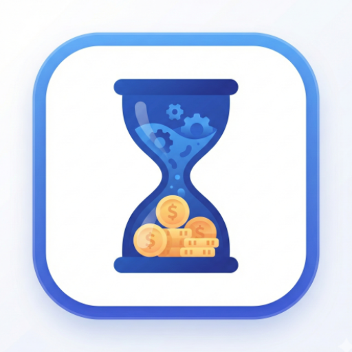
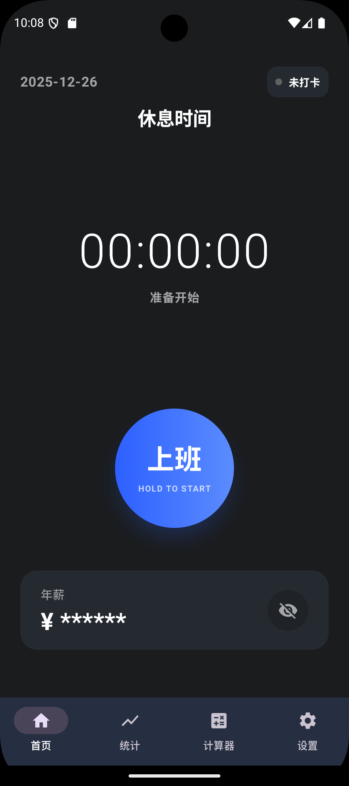
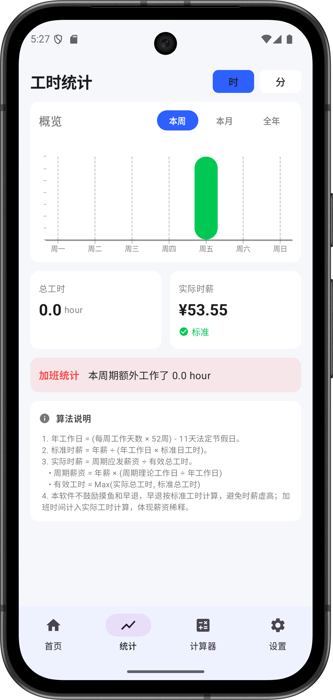
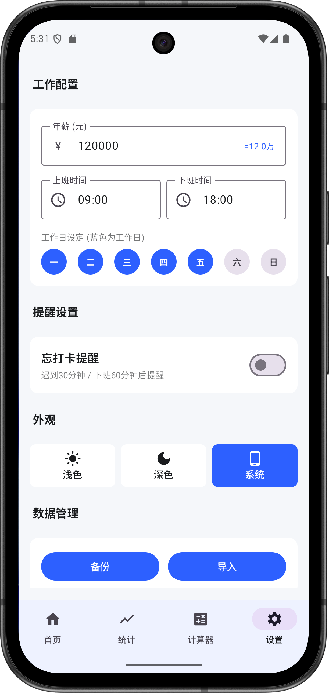

# ⏳ WorkLog

<p align="center">
  
</p>

<p align="center">
  <b>量化时间价值，审视工作性价比。</b><br>
  一个注重隐私、完全离线的 Android 工时记录与反向时薪计算器。
</p>

<p align="center">
  
  
  
  
</p>

## ✨ 核心特性 (Features)

WorkLog 旨在帮助用户清晰地记录工作投入，并通过独特的数据视角重新审视工作的意义。

* **⏱️ 极简记录**：主页长按按钮即可开始/结束计时，无感记录，专注于工作本身。
* **💰 反向时薪**：不仅计算你赚了多少钱，更通过多维算法量化你的“真实时薪”，让你看清加班的边际成本。
* **🔒 隐私优先**：**完全离线**（Offline First）。所有数据存储在本地 Room 数据库中，App 不申请网络权限，绝不上传任何个人数据。
* **📊 详尽统计**：提供日、周、月维度的工时统计与图表分析（即将上线）。
* **🎨 Material You**：遵循最新的 Material Design 3 设计规范，支持动态取色（Dynamic Color）与深色模式，UI 随心而动。

## 📱 截图预览 (Screenshots)

| 主页 (Home) | 统计 (Stats) | 设置 (Settings) | 引导 (Onboarding) |
|:---:|:---:|:---:|:---:|
|  |  |  |  |

## 🛠️ 技术栈 (Tech Stack)

本项目采用现代 Android 开发技术栈构建：

* **语言**: [Kotlin](https://kotlinlang.org/)
* **UI 框架**: [Jetpack Compose](https://developer.android.com/jetpack/compose) (Material 3)
* **架构**: MVVM (Model-View-ViewModel)
* **依赖注入**: Manual Dependency Injection (AppContainer)
* **本地存储**:
    * [Room Database](https://developer.android.com/training/data-storage/room): 用于存储复杂的工时记录。
    * [Jetpack DataStore](https://developer.android.com/topic/libraries/architecture/datastore): 用于存储用户偏好设置（如主题、薪资配置）。
* **异步处理**: Kotlin Coroutines & Flow

## 📥 下载安装 (Download)

你可以直接在 GitHub 的 Releases 页面下载最新的 APK 安装包：

👉 [**下载最新版 v1.0.0**](https://github.com/你的用户名/WorkLog/releases)

## 🚀 快速开始 (Build Setup)

如果你是开发者，想要克隆代码并自行编译：

1.  克隆仓库：
    ```bash
    git clone [https://github.com/guotingfu/WorkLog.git](https://github.com/你的用户名/WorkLog.git)
    ```
2.  使用 **Android Studio** (推荐 Koala 或更新版本) 打开项目根目录。
3.  等待 Gradle Sync 完成。
4.  连接设备或模拟器，点击 **Run** (▶️) 按钮。

## 🤝 贡献 (Contributing)

欢迎提交 Issue 或 Pull Request！
如果你有关于“反向时薪”算法的新点子，或者发现了 Bug，请随时告诉我。

## 📄 许可证 (License)

```text
MIT License

Copyright (c) 2024 [你的名字]
...